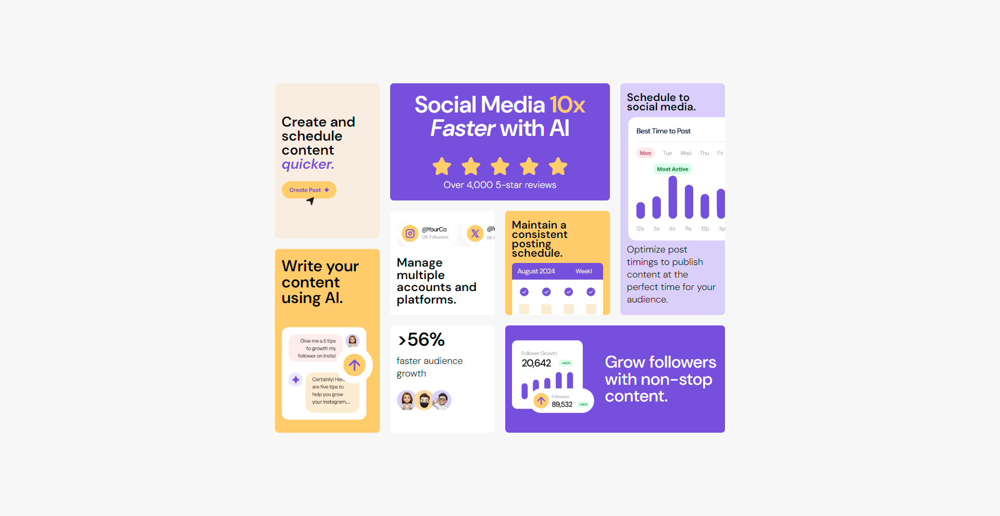

# Frontend Mentor - Bento grid solution

This is a solution to the [Bento grid challenge on Frontend Mentor](https://www.frontendmentor.io/challenges/bento-grid-RMydElrlOj). Frontend Mentor challenges help you improve your coding skills by building realistic projects.

## Table of contents

- [Overview](#overview)
  - [The challenge](#the-challenge)
  - [Screenshot](#screenshot)
  - [Links](#links)
- [My process](#my-process)
  - [Built with](#built-with)
  - [What I learned](#what-i-learned)
  - [Continued development](#continued-development)
- [Author](#author)

## Overview

### The challenge

Users should be able to:

- View the optimal layout for the interface depending on their device's screen size

### Screenshot

### Links

- Solution URL: [Solution](https://github.com/SaeneArmaan/bento-grid-frontend-mentor)
- Live Site URL: [Live URL](https://your-live-site-url.com)

### Built with

- Semantic HTML5 markup
- CSS custom properties
- Flexbox
- CSS Grid
- Mobile-first workflow

### What I learned

I have gained hands-on experience using absolute positioning in CSS. By referencing the MDN Docs, I learned how this property allows elements to be positioned relative to their nearest positioned ancestor, or the viewport if no such ancestor exists. Absolute positioning gives me precise control over the placement of elements on the page, making it useful for overlaying components or positioning items in unconventional layouts. Understanding how to apply this with top, right, bottom, and left values will help in improving my layout-building skills.

### Continued development

To deepen my understanding of absolute positioning, I plan to explore more complex layouts and experiment with different scenarios where elements need precise control. I will work on projects that involve overlapping elements and responsive designs to see how absolute positioning interacts with other CSS properties. Additionally, I’m diving into CSS Grid, a powerful tool for creating flexible, two-dimensional layouts. By studying online tutorials, working through practice exercises, and reviewing real-world examples, I aim to master both techniques and apply them in future projects for more efficient and creative design solutions

## Author

- Frontend Mentor - [@SaeneArmaan](https://www.frontendmentor.io/profile/SaeneArmaan)
- Twitter - [@Armaan2Saini](https://x.com/Armaan2Saini)
